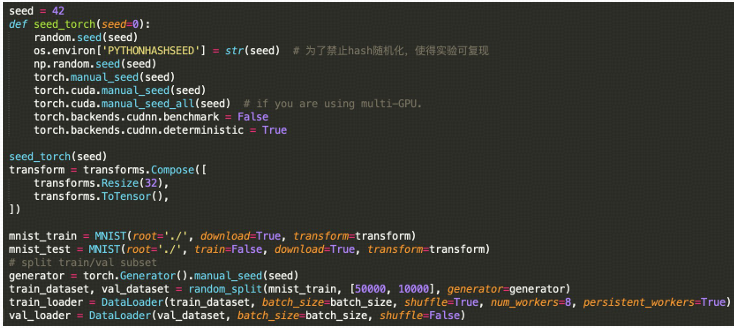

# Few-Shot-Learning
Few Shot Learning

## 大作业
- 总体目标：
把MNIST训练集（mnist_train）划分为train_dataset和val_dataset，train_dataset用于训练
CNN，val_dataset 用于选择CNN的超参数，最后在MNIST测试集（mnist_test）上测试。
- 条件：
对于train_dataset，只允许使用下列图片的标签，其他图片的标签不允许使用。允许使用标签
的图片的索引（train_dataset里的图片索引）为：[1173, 3336, 12529, 12785, 12979, 17351, 27048, 
40579, 43128, 46498]，即对于每个类别，允许使用的有标签的图片个数为1。

- 挑战：
如果只使用上述10个图片及其标签训练CNN，显然会导致过拟合（over-fitting），需要尽可能地使用更多的数据.关键问题：对于给定的每个类别的1个图片，在train_dataset里尽可能地找出与其相似的图片（即属
于同一个簇）。

- 思路：
构建基于自编码机的聚类模型（无监督学习，不能使用图片标签），在嵌入空间中找出和上述给定图片属于同一个簇的图片，把它们的标签设为给定图片的标签。另一个挑战是，聚类算法并不能100%聚类正确。对于每一个簇，可以使用置信度（比如DEC (https://arxiv.org/abs/1511.06335)中的每个
图片属于每个簇的概率或在嵌入空间中使用高斯混合模型聚类，使用其γji）>threshold的图片（threshold 自己设定）或者每个簇中离簇中心距离排名前60%（threshold，自己设定）的图片或者其他方式（这部分是开放性的）。最后，把给定的有标签的10个图片，以及与它们属于同一簇并且置信
度>threshold 或者离簇中心距离排名>threshold的图片作为训练集训练CNN。

- 技巧：
自编码机的编码器和解码器可以都是CNN，上述聚类任务训练完的编码器可以作为分类任务的预训练模型。选择什么样的CNN也是开放问题。把mnist_train 数据集划分为train_dataset和val_dataset时，不同的seed会导致不同的划分。为了统一划分方式，使得上述给定的图片的索引在所有机器上一致，提供如下代码：

提交代码和报告至：yeweiysh@qq.com，截止日期为：2024/6/30 23:59:59

## 少样本学习 【Few shot learning】
Few-shot learning指从少量标注样本中进行学习的一种思想。Few-shot learning与标准的监督学习不同，由于训练数据太少，所以不能让模型去“认识”图片，再泛化到测试集中。而是让模型来区分两个图片的相似性。当把few-shot learning运用到分类问题上时，就可以称之为few-shot classification，当运用于回归问题上时，就可以称之为few-shot regression。